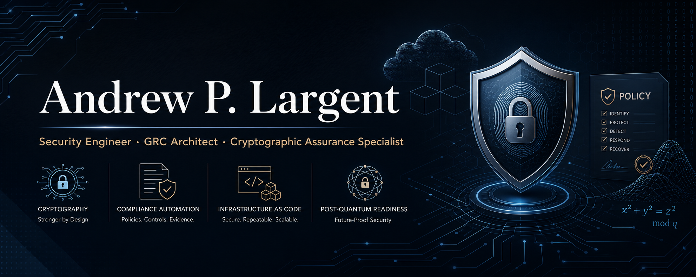

  
  
  
   
  

---

> *I bridge hands-on cryptographic assurance with Governance, Risk, and Compliance (GRC) objectives for federal and regulated environments.*

---

## 🔐 About Me

Security Engineer specializing in the intersection of **cryptographic validation**, **compliance automation**, and **Infrastructure-as-Code**. My work targets the hardest problems in federal and regulated security: automating FIPS 140-3 evidence pipelines, building post-quantum cryptography readiness frameworks, and turning compliance requirements into executable policy.

- 🏛️ Deep focus on **FIPS 140-3 / CMVP** validation processes and entropy source testing (SP 800-90B)
- ⚛️ Building PQC-readiness tooling as NIST finalizes post-quantum standards
- 🤖 Passionate about **Policy-as-Code** (OPA/Rego, Conftest) and compliance automation
- 📜 Pursuing **CGE-P** (Certified GRC Engineer – Practitioner) ✅ Complete
- 🌐 Open-source author of the **Forge** platform ecosystem

---

## 🛠️ Skills

### Compliance & GRC Frameworks

### Cryptography & Validation

### Infrastructure & Automation

### Policy-as-Code & Languages

### Threat & Risk Intelligence

---

## 🚀 Featured Projects

### 🔴 [EntropyForge](https://github.com/IAwiz87/EntropyForge) · *Latest · Python*
> Multi-tenant SP 800-90B / CMVP Entropy Source Validation (ESV) evaluation pipeline.

Combines `trestle` + OSCAL, InSpec, MITRE SAF, and SOPS/age vendor silos into a fully automated entropy evidence pipeline targeting FIPS 140-3 CMVP submissions. Designed for multi-tenant environments requiring isolated cryptographic boundary assessment.

`Python` · `OSCAL/Trestle` · `InSpec` · `MITRE SAF` · `SOPS/age` · `SP 800-90B` · `FIPS 140-3`

---

### 🟠 [QuantumForge](https://github.com/IAwiz87/quantumforge) · *OPA/Rego · ⭐ 3 · 🍴 1*
> Policy-as-code post-quantum cryptography readiness program.

Full Terraform + OPA/Rego policy suite that evaluates infrastructure against PQC migration requirements and generates CI compliance evidence automatically. Covers NIST-finalized PQC algorithms and hybrid transition scenarios.

`OPA/Rego` · `Conftest` · `Terraform` · `GitHub Actions` · `PQC` · `NIST SP 800-208` · `MIT License`

---

### 🟡 [ForgeGRC](https://github.com/IAwiz87/ForgeGRC) · *HTML · ⭐ 6*
> Automated GRC Compliance Platform for federal and regulated environments.

Automated scanning, evidence collection, and compliance workflow platform targeting NIST, FedRAMP, and CMMC requirements. Includes a live GitHub Pages deployment and structured CI pipeline for continuous compliance evidence generation.

`HTML` · `GitHub Actions` · `NIST 800-53` · `FedRAMP` · `CMMC` · `Evidence Automation` · [Live Site →](https://iawiz87.github.io/ForgeGRC)

---

### 🟢 [CyberForge](https://github.com/IAwiz87/CyberForge) · *Multi-language · ⭐ 2*
> Cybersecurity tools and concepts repository.

A practitioner-focused collection of cybersecurity tools, concept implementations, and security engineering references. Serves as the parent ecosystem hub for the Forge platform series.

`Cybersecurity` · `Security Engineering` · `Tools` · `MIT License`

---

### 🔵 [cisa-kev-browser](https://github.com/IAwiz87/cisa-kev-browser) · *HTML · Live Tool*
> Standalone offline browser for the CISA Known Exploited Vulnerabilities (KEV) catalog.

No server, no install — open in any browser. Enables rapid offline triage of KEV entries for vulnerability management and risk prioritization workflows.

`HTML` · `Vulnerability Management` · `CISA KEV` · `Offline-First` · `MIT License` · [Live Tool →](https://iawiz87.github.io/cisa-kev-browser)

---

## 📚 Additional Work

| Repository | Description | Stack | Visibility |
|---|---|---|---|
| [cge-p-labs](https://github.com/IAwiz87/cge-p-labs) | CGE-P certification lab exercises: IaC, Policy-as-Code, Terraform validation, CI/CD evidence | HCL · Rego · YAML | Private |
| [fedramp-poam-pipeline](https://github.com/IAwiz87/fedramp-poam-pipeline) | FedRAMP Baseline → POA&M Automation Pipeline with NIST OSCAL baseline awareness | Python · OSCAL | Private |
| [CyberForge-Compendium](https://github.com/IAwiz87/CyberForge-Compendium) | Structured knowledge base for InfoSec, GRC, and Information Assurance | Markdown | Private |

---

## 📜 Certifications & Training

| Credential | Issuer | Status |
|---|---|---|
| CGE-P — Certified GRC Engineer Practitioner | GRC Certification Body | ✅ Complete |
| Foundations of AI Security | AttackIQ | ✅ Complete |
| ICS Cybersecurity Evaluation (401-Virtual) | DHS / CISA Track | ✅ Complete |

---

## 📈 GitHub Stats

  
  

---

## 🤝 Connect

Open to roles in **federal cybersecurity**, **GRC engineering**, **cryptographic assurance**, and **compliance automation**. Particularly interested in positions involving FIPS 140-3 validation, FedRAMP authorization, or PQC migration strategy.

📧 [alargent87@gmail.com](mailto:alargent87@gmail.com) · 🐙 [github.com/IAwiz87](https://github.com/IAwiz87)

---

Built with precision. Secured by design.

